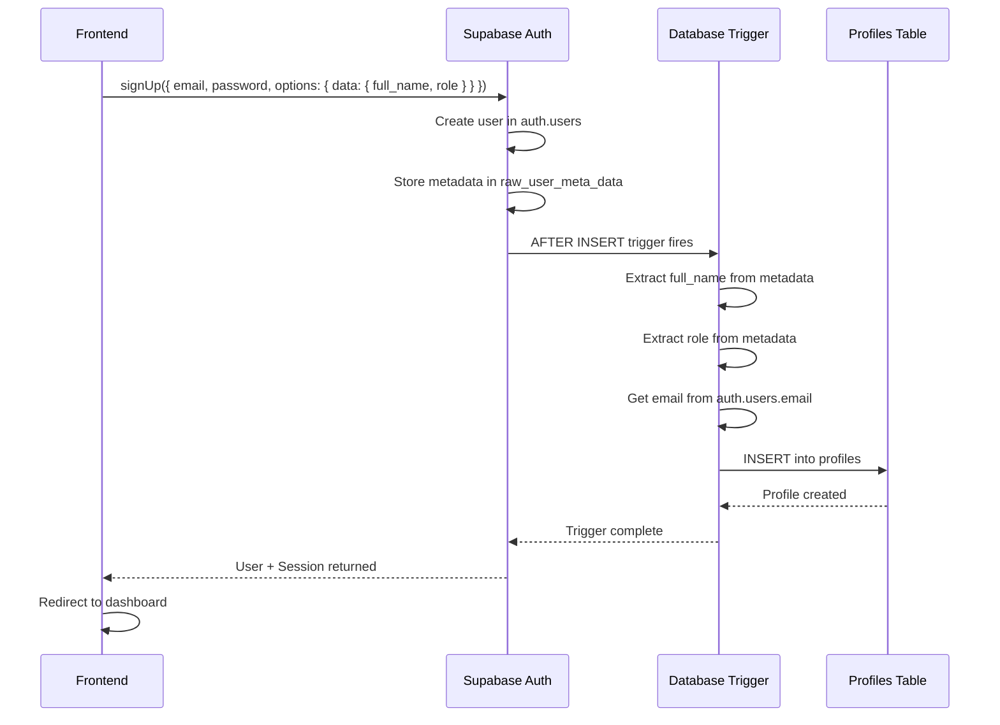

# 🚀 Setup Instructions: Automatic Profile Creation

## Overview
This guide will help you set up the automatic profile creation system that fixes all your auth issues.

---

## 📋 Prerequisites

- Access to your Supabase Dashboard
- SQL Editor access in Supabase
- Your app's dev server stopped (for .env changes if needed)

---

## 🔧 Step-by-Step Setup

### Step 1: Run the Database Trigger SQL

1. Open your **Supabase Dashboard**
2. Go to **SQL Editor** (left sidebar)
3. Click **"New query"**
4. Copy the contents of [`supabase_trigger_auto_create_profile.sql`](file:///p:/SIST/supabase_trigger_auto_create_profile.sql)
5. Paste into the SQL Editor
6. Click **"Run"** or press `Ctrl+Enter`

**Expected output**: "Success. No rows returned" or similar

This creates:
- ✅ A function `handle_new_user()` that reads metadata and creates profiles
- ✅ A trigger that fires automatically when users sign up

---

### Step 2: Apply RLS Policies

1. In **SQL Editor**, create another **"New query"**
2. Copy the contents of [`profiles_rls_policies.sql`](file:///p:/SIST/profiles_rls_policies.sql)
3. Paste and click **"Run"**

**Expected output**: Multiple success messages

This creates:
- ✅ RLS policies so users can view/edit their own profiles
- ✅ Policy allowing authenticated users to insert (needed for trigger)

---

### Step 3: Disable Email Confirmation (Recommended for Testing)

For easier testing, disable email confirmation:

1. Go to **Authentication** → **Providers** → **Email**
2. Find **"Confirm email"** toggle
3. **Turn it OFF**
4. Click **"Save"**

> ⚠️ For production, keep email confirmation ON and test the full flow

---

### Step 4: Test the System

#### Test 1: Fresh Signup

1. Make sure your dev server is running (`npm run dev`)
2. Go to `http://localhost:3000/signup`
3. Fill in:
   - **Name**: Test User
   - **Email**: test@example.com
   - **Password**: Test@123
   - **Role**: student
4. Click **"Create Account"**

**Expected behavior:**
- ✅ User redirected to dashboard
- ✅ No errors in console
- ✅ Profile created automatically

#### Test 2: Verify in Supabase

1. Go to **Supabase** → **Authentication** → **Users**
2. Find your test user
3. Note the `id` (UUID)

4. Go to **Table Editor** → **profiles**
5. Find the row with matching `id`
6. **Verify**:
   - ✅ `full_name` = "Test User"
   - ✅ `email` = "test@example.com"
   - ✅ `role` = "student"
   - ✅ All fields are correct!

#### Test 3: Run Verification Query

In **SQL Editor**, run:

```sql
-- Check that trigger exists
SELECT trigger_name FROM information_schema.triggers 
WHERE event_object_table = 'users' AND trigger_schema = 'auth';

-- Verify profile data
SELECT 
  p.id, 
  p.full_name, 
  p.email, 
  p.role,
  u.email as auth_email,
  u.raw_user_meta_data
FROM profiles p
JOIN auth.users u ON u.id = p.id
ORDER BY p.created_at DESC
LIMIT 5;
```

**Expected:**
- First query shows trigger `on_auth_user_created`
- Second query shows profiles with correct data

---

## ✅ What Changed

### Before (Broken):
```
Frontend → Manual INSERT into profiles → Race conditions & field mapping errors
```

### After (Fixed):
```
Frontend → auth.signUp() → Database Trigger → Automatic profile creation ✅
```

---

## 🎯 Key Benefits

✅ **No more field mapping errors** - Email goes to email, name goes to full_name  
✅ **No race conditions** - Trigger runs atomically  
✅ **No manual profile creation** - All automatic  
✅ **Works with email verification** - Profile created even if email unconfirmed  
✅ **Single source of truth** - Only `auth.signUp()` needed

---

## 🐛 Troubleshooting

### Issue: "Permission denied for table profiles"
**Fix**: Make sure you ran the RLS policies SQL script

### Issue: Profile not created after signup
**Fix**: 
1. Check trigger exists: `SELECT * FROM information_schema.triggers WHERE trigger_name = 'on_auth_user_created';`
2. Check function exists: `SELECT * FROM pg_proc WHERE proname = 'handle_new_user';`
3. Re-run the trigger SQL script if missing

### Issue: "full_name is null in profiles"
**Fix**: 
1. Check that frontend passes `full_name` in `options.data`
2. Verify in browser console that signup sends correct data
3. Check `auth.users.raw_user_meta_data` contains `full_name`

---

## 📁 Files Modified

| File | Status | Description |
|------|--------|-------------|
| [`supabase_trigger_auto_create_profile.sql`](file:///p:/SIST/supabase_trigger_auto_create_profile.sql) | ✅ NEW | Database trigger for auto profile creation |
| [`profiles_rls_policies.sql`](file:///p:/SIST/profiles_rls_policies.sql) | ✅ NEW | RLS security policies |
| [`src/app/signup/page.tsx`](file:///p:/SIST/src/app/signup/page.tsx) | ✅ MODIFIED | Removed manual profile insertion |
| `src/app/api/auth/signup/route.ts` | ⚠️ DELETE | No longer needed (optional cleanup) |

---

## 🎓 Understanding the Architecture



---

## ✨ Next Steps

After testing successfully:

1. Delete the old API route (optional):
   ```bash
   rm src/app/api/auth/signup/route.ts
   ```

2. Remove service role key from `.env` (no longer needed)

3. Test the full production flow with email confirmation ON

4. Deploy to production!

---

**Need help?** Check the logs in:
- Browser console (F12)
- Supabase Logs (Dashboard → Logs)
- Terminal where `npm run dev` is running
